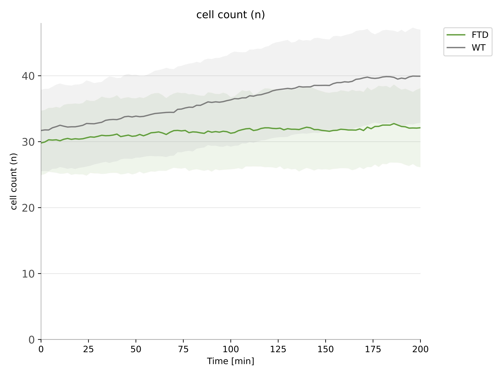

<h1 align="center">
 PhagoStat
</h1>

<p align="center">
 
</p>

<h2 align="center">
Phagocytosis Unveiled:

A Scalable and Interpretable Deep learning Framework for Neurodegenerative Disease Analysis
</h2>

<p align="justify"> PhagoStat is an advanced Python-based pipeline developed to streamline the quantification and analysis of phagocytic activity in dynamic, unstained cells within real-world experimental settings. This innovative tool provides researchers with an efficient and reliable method for evaluating cellular phagocytosis, facilitating a deeper understanding of immune system mechanisms and cellular interactions.


Pre-print paper link : https://hal.science/hal-04067345v1

Thank you in advance for citing the paper and the GitHub repository.

## Installation Steps

1. Install anaconda-python (for more details please check https://docs.anaconda.com/anaconda/install/index.html)

2. Clone the repository

```bash
git clone https://github.com/ounissimehdi/PhagoStat
```

3. Change the working directory

```bash
cd PhagoStat
```

4. Create a conda environment with all the dependencies from the requirements file, then activate your configured Python environment:

```bash
conda activate PhagoStat
```
**Note** that this project is tested on: Windows: 11, MacOS: Ventura 13.2.1 and Lunix: Ubuntu 20.04.3 LTS.

## Microglia video microscopy dataset v1:

<p align="center">
 
 
 
 
</p>

<p align="justify"> This study presents a comprehensive dataset that captures the phagocytosis process in wild-type and FTD microglial cells, with each acquisition comprising 20 distinct scenes and seven hours of time-lapse video microscopy. The dataset has undergone rigorous validation and data quality correction techniques, ensuring its reliability for further analysis. The dataset includes 36,496 normalized cell and aggregate images, 1,306,131 individual instance masks for cells, 1,553,036 for aggregates, and 36,496 registered aggregates, all generated using the PhagoStat algorithm. The dataset also provides extensive biological features such as area, position, and speed, presented frame-by-frame for in-depth analysis. To enhance its value, 226 manually annotated images containing 6,430 individual cell masks were incorporated, covering different conditions and scenes. In total, the dataset comprises 235,288 files (94GB), offering researchers a valuable resource for investigating various cellular and aggregate properties.

<p align="center">
 
</p>

```bash
|-- microglia_video_microscopy_dataset
  |-- FTD
    |-- FTD-1
      |-- scene_0
        |-- labeled_aggregate
        |-- registered_aggregate
        |-- normalized_cell
        |-- CSVs
        |-- normalized_aggregate
        |-- cell_semantic_maps
        |-- labeled_cell
        |-- GIFs
        ...
      |-- scene_19
         ...
    |-- WT-1
      |-- scene_0
        |-- GIFs
        |-- labeled_aggregate
        |-- registered_aggregate
        |-- cell_semantic_maps
        |-- CSVs
        |-- labeled_cell
        |-- normalized_aggregate
        |-- normalized_cell
        ...
      |-- scene_19
         ...

|-- fail_cases
  |-- FTD-3_scene_9
  ...
```

<p align="justify"> By providing this comprehensive dataset, the study aims to facilitate the development and application of novel methodologies in bioinformatics, computational modeling, and cellular biology. This initiative promotes innovation and collaboration among researchers in these interconnected disciplines, ultimately contributing to the understanding of cellular dynamics and the development of novel therapeutic strategies for neurodegenerative diseases like FTD.

<p align="justify"> If you are interested in accessing this dataset, please contact the corresponding author by providing your affiliation and the purpose of downloading the dataset. Upon validation of your request, you will receive a link with a password to access the dataset. This approach ensures that the dataset is used responsibly and for research purposes, fostering collaboration and innovation in the scientific community.

## Data Readout and Normalization Module: Processing Microscopy Data

<p align="justify"> The data readout and normalization module serves as an essential component in our pipeline, responsible for processing raw video microscopy data and transforming it into a standardized format suitable for further analysis, such as converting videos into individual frames. Developed to handle a wide range of data formats, this module initially extracts information from video microscope files, using the CZI format as an example, with the help of the 'aicspylibczi' library. Adapting to alternative formats is made simple by swapping out this library with any other open-source bioformat Python libraries.

<p align="justify"> Designed with high-performance computing (HPC) readiness in mind, this module enables parallelization and scalability, ensuring efficient processing on powerful computing systems. Once the data is extracted, the normalization module employs an adapted technique to standardize the data and convert it from 16-bit to 8-bit representation, resulting in consistent processing and reduced computational demands. The Python Imaging Library (PIL) is utilized to save data in open formats, such as PNG and TIF, which promotes easy access and compatibility with a wide array of image processing tools.

<p align="justify"> To demonstrate its output, the following illustration provides an example of the standardization process applied to cell and aggregate data:

</p>

<p align="center">
   
</p>
<p align="center"> Normalized cell & aggregate data 
</p>


<p align="justify"> In 'PhagoStat_interface.py', lines 109-128 showcase the simplicity of using this module. By providing the CZI file path and the scene number (in our use case: ranging from 0 to 19, for a total of 20 scenes), the module processes the input and generates two separate channels: cell and aggregate. These 8-bit frames are then normalized and saved to the specified output path, streamlining the process of working with the processed data.


</p>

#### How to use:
For a local machine, execute the following command:
```bash
python PhagoStat_interface.py   -acq_path '/path/to/file.czi' \
                                -output_path '/path/to/save/file'\
                                -acquisition_offset 'OFFSET'\
                                -scene_identification 'SC_ID'\
                                -to_frames\
```

<p align="justify"> Within 'PhagoStat_interface.py', variables can be customized: 'acq_path', 'output_path', 'OFFSET' and 'SC_ID'. These are used to locate the .czi file by specifying its path, offset, and name. Conversely, 'SC_ID' is the ID of the scene you wish to process, ranging from 0 to 19 in our case. By adjusting these variables and adding '-to_frames', you can easily tailor the module to accommodate your specific data and scene requirements.

<p align="justify"> To optimize the module on a local machine with multiple CPUs, such as four available CPUs, use the 'taskset' command on Unix systems to process each scene on a distinct CPU. Execute the following commands in separate terminal windows:


```bash
# In the first terminal
taskset --cpu-list 0 python PhagoStat_interface.py    -acq_path '/path/to/file.czi' \
                                                      -output_path '/path/to/save/file'\
                                                      -acquisition_offset 'OFFSET'\
                                                      -scene_identification 0\
                                                      -to_frames\

# In the second terminal
taskset --cpu-list 1 python PhagoStat_interface.py    -acq_path '/path/to/file.czi' \
                                                      -output_path '/path/to/save/file'\
                                                      -acquisition_offset 'OFFSET'\
                                                      -scene_identification 1\
                                                      -to_frames\

# In the third terminal
taskset --cpu-list 2 python PhagoStat_interface.py    -acq_path '/path/to/file.czi' \
                                                      -output_path '/path/to/save/file'\
                                                      -acquisition_offset 'OFFSET'\
                                                      -scene_identification 2\
                                                      -to_frames\

# And so on...
```

<p align="justify"> By assigning each CPU to process a different scene using the --cpu-list option, you can efficiently distribute the workload across your machine's available CPUs. Remember to open a new terminal for each command to run the tasks concurrently.

For High-Performance Computing (HPC) systems that use SLURM, use this command:
```bash
sbatch id_acquisition_analysis.sh
```

<p align="justify"> In 'id_acquisition_analysis.sh', you'll find the same variables as in the local machine setup. In addition, you'll see #SBATCH --array=0-19 (if you have 20 scenes in the same raw data file) to define the number of arrays for running jobs in parallel for a given -dic_id 'DIC_ID'. This setup allows for efficient processing on HPC systems with SLURM.

</p>

## Data Quality Check and Shift Correction Module: Ensuring Reliable and Accurate Data

<p align="justify"> The 'Data Quality Check and Shift Correction' module serves as a critical component in our pipeline, safeguarding data reliability and accuracy by counteracting undesired microscope micro-movements, such as vibrations, which can negatively affect high-resolution microscopy precision. Designed to be HPC-ready, this module utilizes a generalized, scalable version of the Enhanced Correlation Coefficient maximization approach (ECC), called Cascade ECC (CECC), to register images and correct subtle shifts induced by these movements.

<p align="justify"> The CECC method effectively mitigates vibrations and microscopic instabilities, producing reliable frames suitable for high-precision quantification. The accompanying illustration highlights the module's efficacy in addressing microscope shaking, comparing original aggregate frames with corrected ones and illustrating the estimated micron shifts detected and corrected.

<p align="justify"> In summary, this module transforms unstable data into stable, dependable frames, which are vital for accurate high-precision analysis. Furthermore, it supports parallelization and scalability on HPC systems.

</p>

<p align="center">
   
</p>
<p align="center">
   Data Quality Check and Shift Correction Module: Ensuring Reliable and Accurate Data
</p>


<p align="justify"> This module contains the following parameters, as found in lines 91-104 of PhagoStat_interface.py: 'gauss_size', 'eps_err', and 'max_itr'. The 'gauss_size' parameter represents the last Gaussian kernel size of the CECC (n=5) method, as described in our paper. The 'eps_err' parameter denotes the error tolerance between two consecutive frames, while 'max_itr' indicates the maximum number of iterations performed if the 'eps_err' cannot be reached. These parameters are initialized as utilized in our work, ensuring coherent and straightforward implementation.

</p>

#### How to use: 
To run the program on a local machine, execute the following command:
```bash
python PhagoStat_interface.py   -acq_path '/path/to/file.czi' \
                                -output_path '/path/to/save/file'\
                                -acquisition_offset 'OFFSET'\
                                -scene_identification 'SC_ID'\
                                -reg\
```
This command assumes the frame version of the raw video data has already been generated, enabling registration to be performed on the TIF frames. Alternatively, add the -to_frames option to generate the frames and subsequently perform registration.

For HPC systems utilizing SLURM, execute the following command:
```bash
sbatch id_acquisition_analysis.sh
```
As with the local machine instructions, ensure that all frames for every scene have been generated prior to running the program on an HPC system.

**Blur detection:** <p align="justify"> We have integrated the blur detection mechanism seamlessly into the aggregate quantification module to simplify implementation and enhance performance. This mechanism computes the Laplacian variance and estimates the relative difference between two consecutive frames. In cases where there is a substantial decline in image sharpness (loss of pixel details) beyond a predetermined threshold, the frame will be excluded. The following illustration exemplifies the operation of this process:

</p>

<p align="center">
   
</p>
<p align="center">
   Blur detection & rejection mechanism
</p>

<p align="justify"> For blur rejection, we have 'blur_eps' (the relative error tolerance in the Laplacian variance) and 'search_frames' (the number of frames to examine if blur is detected; the process resumes if the blur ends, otherwise the scene will be rejected as 'bad data').

## Aggregate Quantification:

<p align="justify"> The Aggregate quantification module encompasses the following parameters: 'frame_time' (time step per frame, with 1 frame corresponding to 2 minutes in our case), 'area_resolution' (microscope resolution, where 1 pixel^2 is equivalent to 0.103^2 microns), 'aggregates_th' (a fixed threshold for segmenting aggregates versus background in the fluorescent aggregate channel), and 'ignore_debris_area' (a threshold to exclude excessively large aggregates if necessary).

<p align="justify"> The subsequent illustration showcases an example of aggregate quantification for a scene that has already undergone data quality checks, including the stabilization of aggregate frames using shift correction and the elimination of blurry frames through the blur detection mechanism. On the left, red bounding boxes represent the detected, uneaten aggregates in a time-lapse animation. In the upper right, the graph depicts the number of aggregates present in the scene over time. In the lower right, the graph demonstrates the total surface area of phagocytosed (eaten) aggregates as a function of time.

</p>

<p align="center">
   
</p>
<p align="center">
   Aggregate quantification
</p>

#### How to use: 
For a local machine, use the following command:
```bash
python PhagoStat_interface.py   -acq_path '/path/to/file.czi' \
                                -output_path '/path/to/save/file'\
                                -acquisition_offset 'OFFSET'\
                                -scene_identification 'SC_ID'\
                                -det\
```

For High-Performance Computing (HPC) systems that use SLURM, use this command while adding '-det' at the end of the command:
```bash
sbatch id_acquisition_analysis.sh
```

## Cellular Quantification:

### Semantic mask estimation:

<p align="justify">This module loads the pre-trained model and predicts the semantic mask of cells, facilitating the quantification of the total cellular area over time. It generates the final probability maps in a TIF format (float), allowing future users the flexibility to apply thresholds as they deem suitable. Furthermore, this output will be employed to estimate cell instances using the Traceable Time Coherence Module (TTCM) described in the paper. It is worth noting that this module is GPU-compatible, which significantly reduces the computational time of this step from 35 minutes to a mere 30 seconds. The following illustration showcases the result as a heatmap:


<p align="center">
   
</p>
<p align="center">
   Cellular quantification: semantic mask estimation
</p>

#### How to use: 
For a local machine, use the following command:
```bash
python PhagoStat_interface.py   -acq_path '/path/to/file.czi' \
                                -output_path '/path/to/save/file'\
                                -acquisition_offset 'OFFSET'\
                                -scene_identification 'SC_ID'\
                                -prob_maps\
```

For High-Performance Computing (HPC) systems that use SLURM, use this command while adding '-prob_maps' at the end of the command:
```bash
sbatch id_acquisition_analysis.sh
```

### Instances & trajectories estimation:

<p align="justify">This module adeptly integrates multiple vital elements to refine the analysis of cellular dynamics. By incorporating semantic segmentation over time, the module effectively differentiates cell instances using the TTCM. Concurrently, it accounts for corrected microscope movement, enabling the estimation of cell motion by eliminating vibrations and other artifacts.

<p align="justify">Capitalizing on cellular features, such as cell area and centroid position, the module employs the 'btrack' library to track cells over time. This cohesive approach streamlines the quantification of various instantaneous cell parameters, including mean area, mean speed, cell count, and cumulative movement. Consequently, this all-encompassing methodology offers a more robust and precise evaluation of cellular behavior and temporal dynamics.

<p align="justify">To demonstrate the efficacy of this approach, we present a compelling animation that vividly illustrates the module's ability to track cells and analyze their dynamic properties over time.

<p align="center">
   
</p>
<p align="center">
   Cellular quantification: instances & trajectories estimation
</p>

#### How to use: 
For a local machine, use the following command:
```bash
python PhagoStat_interface.py   -acq_path '/path/to/file.czi' \
                                -output_path '/path/to/save/file'\
                                -acquisition_offset 'OFFSET'\
                                -scene_identification 'SC_ID'\
                                -cell_det -cell_trk
```

For High-Performance Computing (HPC) systems that use SLURM, use this command while adding '-cell_det -cell_trk' at the end of the command:
```bash
sbatch id_acquisition_analysis.sh
```

**Note:** to run all previous steps in one command line use (same for SLURM):
```bash
python PhagoStat_interface.py   -acq_path '/root/raw_data/WT-1.czi'\
                                -output_path '/root/microglia_video_microscopy_dataset/WT/WT-1'\
                                -acquisition_offset 0\
                                -scene_identification 'SC_ID'\
                                -to_frames\
                                -reg\
                                -det\
                                -prob_maps\
                                -cell_det -cell_trk\
```

## Phagocytosis quantification & statistics report generation: 

<p align="justify"> We have designed a module to consolidate results at the scene level, streamlining data analysis for complex experiments. To provide some context, one acquisition encompasses 20 video scenes, each lasting 7 hours. In this example, we demonstrate the utility of this module by processing the results of 10 acquisitions (5 wild-type, 5 FTD) for the initial 200 minutes, resulting in 20,000 data points for each measured feature. This module effectively simplifies the complex nature of the data into an easily readable and interpretable format.</p>

<p align="justify"> As an illustration, we present the output of this module for a given acquisition, visualizing the number of aggregates and cell count over time across all scenes within the acquisition:</p>

<p align="center">
   
   
</p>
<p align="center">
   Detailed dynamics summary per acquisition (one acquisition contain multiple scenes):
</p>

### Comparative Analysis of WT vs FTD using Mean Curves:

To facilitate the comparison between wild-type (WT) and FTD groups, our module employs a three-step approach for generating mean curves:

1. **Per-acquisition mean and standard deviation:** For each acquisition, the module computes the mean and standard deviation dynamics, averaging over all scenes within the acquisition.

2. **Per-condition mean and standard deviation:** Subsequently, the module calculates the mean and standard deviation curves for each condition (e.g., FTD) by averaging over all acquisitions pertaining to that condition.

3. **Mean dynamic visualization:** Finally, the resulting mean dynamics are plotted in a single, concise figure, making it simple and easy to interpret the data.

</p> As an example, we showcase the following figures that depict the aggregate area consumed by cells, the mean cell area, and the cell count over time for both WT and FTD groups. This comparative analysis facilitates a more comprehensive understanding of the differences in phagocytosis between the two conditions.</p>

<p align="center">
   
   
   
</p>
   
<p align="center"> Detailed dynamics summary per condition (FTD vs WT) </p>

<p align="justify"> 
To statistically assess the significance of differences between FTD and WT groups, our module employs a robust approach that leverages the Mann-Whitney-Wilcoxon test to determine if the observed distinctions in phagocytosis behavior are significant.</p>

<p align="justify"> For each curve representing the mean behavior over the first 200 minutes, the module calculates the mean values and automatically applies the Mann-Whitney-Wilcoxon test. This approach simplifies the evaluation of large-scale video microscopy data, transforming gigabytes of information into easy-to-read box plots.</p>

<p align="justify"> These box plots offer clear, concise visualizations that facilitate the extraction of biological insights related to the phagocytosis phenomenon. By automating the statistical analysis process, researchers can more efficiently compare FTD and WT groups, ultimately advancing our understanding of the underlying mechanisms governing phagocytosis.
</p>

<p align="center">
   
   
   
   
</p>

<p align="center">
   
   
   
   
</p>

<p align="center"> Overall quantification summary per condition (FTD vs WT). Statistical significance conducted by using Mann-Whitney-Wilcoxon with ns (p-value equal-above 0.05), ** (p-value under 0.01), and *** (p-value under 0.001)</p>

### How to use:
```bash
cd report_generator
python step_0_gen_report.py
```
<p align="justify"> Utilizing the provided Jupyter notebook, 'step_1_gen_report.ipynb', you can efficiently generate all the necessary figures to visualize and compare the phagocytosis behavior of the FTD and WT groups. The notebook has been designed with flexibility in mind, allowing for customization to accommodate your specific research requirements.

<p align="justify"> Feel free to explore and modify the 'step_0_gen_report.py' & 'step_1_gen_report.ipynb' notebook to adapt it to your specific research context, ensuring that the generated figures and statistical analyses align with your scientific objectives.

## Performance quantification:
### Execution time profiling (sorted from long to fast):

| PhagoStat tasks                                                    | Time Elapsed on CPU only (min)    |
|--------------------------------------------------------------------|-----------------------------------|
| Data Quality Check & Shift Correction                              | 43                                |
| Cellular Quantification: Semantic Mask Estimation                  | 35 (30 sec with GPU)              |
| Data Efficient Loading & Normalization: Raw to Open-Format         | 07                                |
| Cellular Quantification: Instance Mask & Trajectories Estimation   | 07                                |
| Aggregates Quantification & Blur Rejection                         | 03                                |
| Phagocytosis quantification & statistics report generation         | 02                                |


<p align="justify"> This experiment was conducted using a single-core Xeon Gold 6126 CPU and 4GB of RAM per task, with an Nvidia RTX2080 GPU utilized for semantic mask estimation. The execution time was affected by the level of noise in the data.

<p align="justify"> It is important to note that this software package was tested on a high-performance computing (HPC) system running 10 acquisitions, each containing 20 scenes. Each scene had approximately 210 images per channel, resulting in a simultaneous job array of 200 tasks. Each task was allocated one CPU core and 4GB of RAM. No input/output (I/O) bottlenecks were observed during the testing process, indicating that the system is highly scalable.

### Registration performance:

|                          | **Absolute error**  |**Absolute error**  |                |
|--------------------------|---------------------|--------------------|----------------|
|                          | along x-axis        | along y-axis       | Speed(sec)     |
| ECC                      | 196.02±119.34       | 206.93±116.50      | **0.92±0.72**  |
| SIFT                     |  _0.0153±0.0609_    | _0.0228±0.1221_    | _3.09±0.12_    |
| **Ours:CECC (n=5)**      | **0.0079 ± 0.0046** | **0.0081±0.0047**  | 8.77±0.20      |


<p align="justify"> Performance evaluation of our CECC registration method compared to the state-of-the-art. We report the results as the mean ± standard deviation, calculated over 1,000 registration tests. Independent random shifts along the x and y axes were generated within a range of ±400 pixels for 2048x2048 pixel images. The best metrics per column are bolded, and the second-best metrics are underlined. Absolute error is calculated based on the difference between the estimated registration coordinates and the ground truth, which are the generated shifts along the x and y axes. Registration time cost is determined by the time taken to register a pair of images (reference and shifted). We conducted the evaluation using the following hardware: a 4-core Xeon Gold 6126 CPU and 1GB RAM. For the SIFT method, we used 2GB RAM, as 1GB was insufficient.

### Cell instance segmentation performance:

|                         | **Detection metrics** |                |                |                |                | **Semantic metric**  | **Speed metrics**|                |
|-------------------------|-----------------------|----------------|----------------|----------------|----------------|----------------------|------------------|----------------|
|                         | mIoU(%)               | F1(%)          | Accuracy(%)    | Precision(%)   | Recall(%)      | Dice(%)              | Train epochs     | Inference(sec) |
| Cellpose                | 63.85±1.39            | 83.35±1.41     | 72.22±1.99     | 91.30±1.75     | 77.09±1.24     | 84.51±1.16           | 500              | 1.032±0.0238   |
| Stardist                | 66.21±0.96            | 85.82±0.93     | 76.04±1.31     | **94.80±0.15** | 78.95±1.47     | 87.86±0.52           | 400              | 0.222±0.0173   |
| **Ours:Att-UNet (XAI)** | **73.55±1.41**        | _86.53±1.64_   | _77.00±2.47_   | 89.00±2.63     | **84.53±1.55** | _93.77±0.34_         | **20**           | _0.157±0.0021_ |
| **Ours:** Att-UNet+LSTM  | 71.17±2.77            | 86.12±2.52     | 76.73±3.54     | 92.20±3.20     | 81.33±2.72     | 91.87±2.6            | 40               | 0.369±0.0062   | 
| **Ours:** UNet+LSTM      | 72.23±1.95            | **86.90±1.80** | **77.72±2.53** | _93.47±1.61_   | 81.66±2.20     | **94.04±0.28**       | 40               | 0.369±0.0062   |
| **Ours:** UNet (XAI)     | _72.29±2.6_           | 85.44±2.12     | 75.72±2.92     | 87.95±2.87     | _83.56±2.46_   | 93.18±1.18           | **20**           | **0.136±0.0069** |
| **Ours:** BiONet+LSTM    | 63.94±6.48            | 80.25±5.41     | 68.44±7.01     | 90.83±2.88     | 72.73±7.44     | 92.2±2.78            | 40               | 0.306±0.0062   |
| **Ours:** BiONet (XAI)   | 65.94±5.31            | 81.43±4.13     | 70.09±5.33     | 88.67±3.67     | 75.99±5.95     | 91.24±2.66           | **20**           | 0.203 ± 0.0042 | 

<p align="justify"> Five-fold testing: Quantitative performance evaluation of the cell segmentation module (DL/IDL) compared to state-of-the-art methods. The reported results are the $(mean \pm standard~deviation)$, computed over 5-fold testing. The best metrics (per column) are highlighted in bold, and the second-best metrics are underlined. Instance-level segmentation (detection) evaluations were used to assess performance with different metrics (per cell mask). The mIoU (mean Intersection over Union) is calculated as the sum of IoU (cell mask-wise) of the predicted cell masks divided by the ground-truth cell count. To report these metrics, we used $IoU\geq50\%$ between ground truth and predicted masks to compute TP, FP, and FN. The $F1$ score is defined as $F1 = \frac{2TP}{2TP+FP+FN}$, while the $Accuracy = \frac{TP}{TP+FP+FN}$, $Precision = \frac{TP}{TP+FP}$, and $Recall = \frac{TP}{TP+FN}$. We utilized a semantic segmentation metric (i.e., Dice coefficient) to quantify the foreground/background pixel-wise separation, defined as $Dice = \frac{2\lvert gt \cap pred \rvert}{\lvert gt \rvert + \lvert pred \rvert}$, where $gt$ is the ground truth mask and $pred$ is the predicted mask ($background = 0, foreground = 1$). The training epochs refer to the number of epochs needed to complete the training phase. Inference time (after training on the test set) per image was computed using the following hardware: an 8-core i7 9700K CPU, 16GB RAM, NVIDIA.


## Citation

```bash
@misc{ounissi2023phagocytosis,
  author = {Ounissi, Mehdi and Latouche, Morwena and Racoceanu, Daniel},
  title = {Phagocytosis Unveiled: A Scalable and Interpretable Deep learning Framework for Neurodegenerative Disease Analysis},
  year = {2023},
  journal = {GitHub (Pre-print)},
  url = {\url{https://github.com/ounissimehdi/PhagoStat}}
}

@unpublished{ounissi:hal-04067345,
  TITLE = {{Phagocytosis Unveiled: A Scalable and Interpretable Deep learning Framework for Neurodegenerative Disease Analysis}},
  AUTHOR = {Ounissi, Mehdi and Latouche, Morwena and Racoceanu, Daniel},
  URL = {https://hal.science/hal-04067345},
  NOTE = {preprint},
  YEAR = {2023},
  MONTH = Apr,
  KEYWORDS = {explainable artificial intelligence ; phase-contrast video microscopy ; neuro-phagocytosis ; neurodegenerative disease ; deep learning ; image processing},
  HAL_ID = {hal-04067345},
  HAL_VERSION = {v1},
}

```
